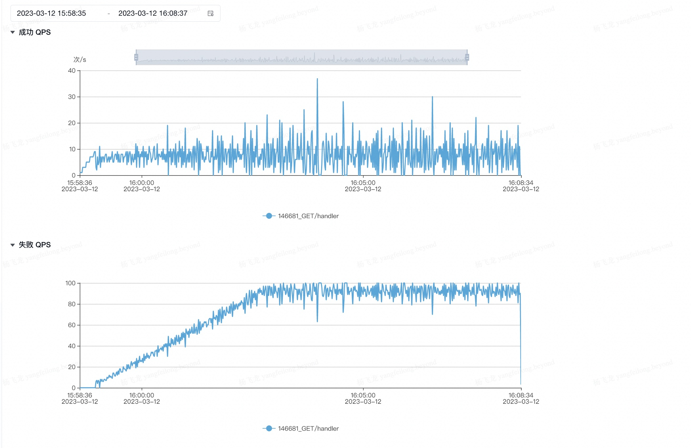
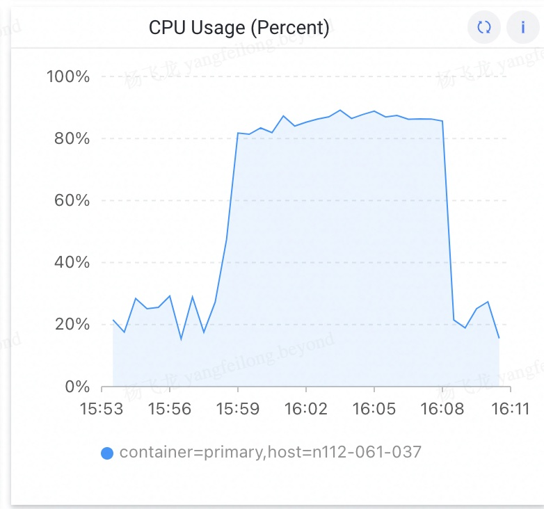

# Plato 组件介绍
一句话概括，pid 限流基于实例的 CPU 使用率，通过拒绝一定比例的流量，将实例的 CPU 使用率阈值稳定在设定的阈值上。

# PID 算法
解决目标：传统的线性调节算法简单粗暴，单纯按照CPU上涨的幅度，线性地调节拒绝流量比例。但是这种算法在模型上得不到很少的最终收敛效果，最终呈现出CPU持续震荡，收敛缓慢的结果。
使用PID算法，加入了积分和微分控制，从不同角度多层次调节输入，使得调节更快的收敛，在实际验证中效果更好。


| 参数 | 解释 |  用途|
| --- | --- | --- |
| KP |目标值减去当前值的系数  | 用来从宏观上控制拒绝比例上调还是下降 |
|KI|历史误差的总和(积分)的系数|也称为稳态误差系数，加上历史误差，防止系统在阈值附近不断的震荡，维持系统稳定|
|KD|误差在当前的时刻的导数(微分)的系数|为了能够让系统对于突增情况更快的作出反应|


# 防止误限
解决目标：使用 z-score 过滤异常点，防止因为CPU尖刺导致瞬时限流

# 使用方式
## Gin 服务直接接入
```
import "github.com/bytedance/pid_limits/application/adaptive"

func main(){
    ...
    r.Use(adaptive.PlatoMiddlewareGinDefault(0.8))
    ...
}
```
## 原生 limiter 接入

```
import "github.com/bytedance/pid_limits/application/adaptive/limiting"

r :=  new_route_function() // 通过其他框架初始化得到的 route 实例

limit := limiting.NewPidLimitingHttpDefault(0.8)
r.Use(func(c context.Context, ctx *app.RequestContext) {
    if limit.Limit() {  // 每次处理请求之前，判断下基于 pid 组件是否需要限流
        ctx.AbortWithStatus(510)
        return
    }
    ctx.Next(c)
})
```

# 高级用法
>除非特别了解，否则不建议使用高级配置
## 自定义pid 参数
使用者可以根据需要，自定义参数。
```
import "github.com/bytedance/pid_limits/application/adaptive"

func main(){
    ...
    r.Use(adaptive.PlatoMiddlewareGin(kp, ki, kd, 0.8))
    ...
}
```

## 动态调整限流参数
在业务运行过程中，需要动态调整限流阈值，例如，通过动态下发配置，完成限流阈值的调节
```
import (
    "github.com/bytedance/pid_limits/application/adaptive"
    "github.com/bytedance/pid_limits/application/adaptive/config"
)
func main(){
    ...
    r.Use(adaptive.PlatoMiddlewareGinDefault(0.8, config.WithDynamicPoint(func()float64{
      var threshold float64
      // 通过动态下发配置，或者其他方式，定义 threshold
      return threshold
    })))
    ...
}
```

## 调整限流敏感度
为了避免误限，PID内部默认 限流阈值 +- 0.1 的浮动。例如， 当限流阈值定义为 0.7：
- 内部 cpu monitor 检测到 cpu 使用率达到 0.8 会触发 PID 限流功能，将CPU 使用率限制到 0.7
- 在 cpu monitor 检测到 cpu 使用率低于 0.6 之后，关闭 PID 限流
上下水位可以理解为限流的触发机制，这个水位越小，敏感度越高，但是误限的概率会增大，默认为 0.1 是当前看似较好的解法。
> 误限是一直存在的问题，系统运行过程中，会有 GC 事件，对于 混布的服务，会有 quota 被抢占的问题，这些都会导致 CPU 使用率升高。虽然 cpu monitor 中，已经加入了 zscore 算法过滤尖刺，但为了能够尽可能的避免误限，还是加入了上下水位触发限流机制。

```
import (
    "github.com/bytedance/pid_limits/application/adaptive"
    "github.com/bytedance/pid_limits/application/adaptive/config"
)
func main(){
    ...
    r.Use(adaptive.PlatoMiddlewareGinDefault(0.8, config.WithDrift(0.1)))
    ...
}

```

# 效果测试
通过 原生 limiter 接入 之后，对目标实例持续增加QPS发压 （设定CPU利用率 0.8）




通过拒绝一定的请求，实例的CPU稳定在 80% ~ 85% 之间




# Contribution

Please check [Contributing](CONTRIBUTING.md) for more details.

# Code of Conduct

Please check [Code of Conduct](CODE_OF_CONDUCT.md) for more details.

# Security

If you discover a potential security issue in this project, or think you may
have discovered a security issue, we ask that you notify Bytedance Security via our [security center](https://security.bytedance.com/src) or [vulnerability reporting email](sec@bytedance.com).

Please do **not** create a public GitHub issue.

# License

This project is licensed under the [Apache-2.0 License](LICENSE).
